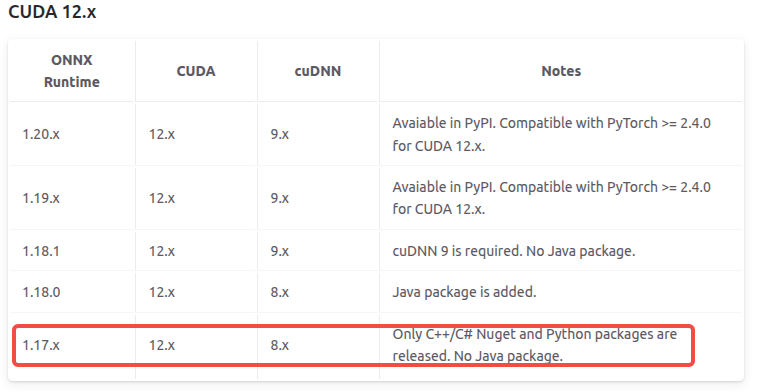

# yolo11-onnx-cpp
use onnx-runtime to inference YOLOv11 model by c++

# Inference by c++ for onnx runtime

## Linux platform

- CUDA 12.1 + cudnn8.9.7
- cmake 3.17.5
- ubuntu18.04
- [opencv4.5.5](https://github.com/opencv/opencv/releases/tag/4.5.5)
- [librealsense 2.50.0](https://github.com/IntelRealSense/librealsense/releases/tag/v2.50.0)
- [yaml-cpp](https://github.com/jbeder/yaml-cpp.git)
- [GPU: onnxruntime-linux-x64-gpu-cuda12-1.17.3/CPU: onnxruntime-linux-x64-1.17.3](https://github.com/microsoft/onnxruntime/releases/tag/v1.17.3)
  - [NVIDIA - CUDA](https://onnxruntime.ai/docs/execution-providers/CUDA-ExecutionProvider.html)



Follow command to build

```shell
mkdir build && cd build
cmake -DBUILD_GPU=true ..#use gpu
#cmake -DBUILD_GPU=false ..#use cpu
make -j10
```

Run the demo

- for image inference

```shell
./image_inference
```

- for video inference

```shell
./video_inference
```

- for realsense camera inference

```shell
./camera_inference
```


## Windows platform

- CUDA 12.1 + cudnn8.9.7
- [cmake 4.0.3](https://github.com/Kitware/CMake/releases/download/v4.0.3/cmake-4.0.3-windows-x86_64.msi)
- [mingw32](https://github.com/mstorsjo/llvm-mingw/releases/download/20250613/llvm-mingw-20250613-ucrt-x86_64.zip)

Follow command to build

```shell
mkdir build && cd build
cmake -G "MinGW Makefiles" -DBUILD_GPU=ON ..#use gpu
#cmake -G "MinGW Makefiles" -DBUILD_GPU=OFF ..#use cpu
mingw32-make.exe
```

---

Run the demo

- for image inference

```shell
.\image_inference.exe
```

- for video inference

```shell
.\video_inference.exe
```

- for realsense camera inference

```shell
.\camera_inference.exe
```

